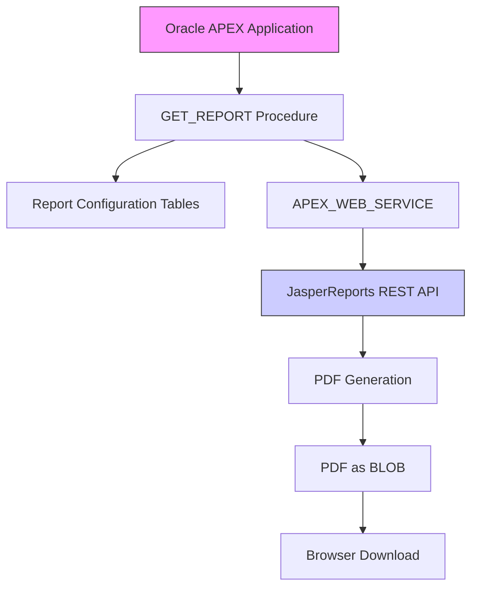

# Oracle APEX - JasperReports PDF Integration

## 📋 Project Overview

A production-ready integration solution that enables Oracle APEX applications to dynamically generate and download PDF reports from JasperReports Server via REST API. This implementation provides a secure, configurable bridge between Oracle Database environments (including Autonomous Database) and JasperReports Server.

## ✨ Key Features

| Feature | Description |
|---------|-------------|
| **Dynamic Integration** | REST-based communication with JasperReports Server |
| **Parameter Support** | Runtime parameter override with fallback to defaults |
| **Centralized Configuration** | Database-driven server and report settings |
| **Secure Authentication** | Basic Auth with credential storage |
| **Direct PDF Streaming** | BLOB-to-browser delivery without intermediate files |
| **APEX Compatibility** | Designed for Oracle APEX and ORDS environments |
| **Comprehensive Error Handling** | Detailed diagnostics and status reporting |
| **Scalable Architecture** | Suitable for enterprise deployments |

## 🏗 System Architecture



## 📊 Database Schema

### **Report Settings Table** (`MANG_SYS_SEC_REPORT_SETTINGS`)
Stores JasperReports server connection configurations.

```sql
CREATE TABLE MANG_SYS_SEC_REPORT_SETTINGS (
    settings_id        NUMBER PRIMARY KEY,
    jasper_server_url  VARCHAR2(500) NOT NULL,
    username           VARCHAR2(100) NOT NULL,
    password           VARCHAR2(100) NOT NULL,
    is_active          CHAR(1) DEFAULT 'Y',
    created_date       DATE DEFAULT SYSDATE,
    updated_date       DATE DEFAULT SYSDATE,
    CONSTRAINT chk_active CHECK (is_active IN ('Y', 'N'))
);
```

### **Report Configuration Table** (`MANG_SYS_SEC_REPORT_CONFIG`)
Defines individual reports and their default parameters.

```sql
CREATE TABLE MANG_SYS_SEC_REPORT_CONFIG (
    report_id      NUMBER PRIMARY KEY,
    settings_id    NUMBER NOT NULL,
    report_path    VARCHAR2(500) NOT NULL,
    report_name    VARCHAR2(200) NOT NULL,
    default_params VARCHAR2(500),
    is_active      CHAR(1) DEFAULT 'Y',
    created_date   DATE DEFAULT SYSDATE,
    updated_date   DATE DEFAULT SYSDATE,
    FOREIGN KEY (settings_id) 
      REFERENCES MANG_SYS_SEC_REPORT_SETTINGS(settings_id),
    CONSTRAINT chk_active_config CHECK (is_active IN ('Y', 'N'))
);
```

## ⚙️ Core Implementation

### **Main Procedure: `GET_REPORT`**

```sql
CREATE OR REPLACE PROCEDURE GET_REPORT (
    p_report_id      IN NUMBER,
    p_settings_id    IN NUMBER,
    p_param_value    IN VARCHAR2 DEFAULT NULL
) IS
    v_blob BLOB;
    v_file_name VARCHAR2(200);
    v_jasper_server_url VARCHAR2(500);
    v_username VARCHAR2(100);
    v_password VARCHAR2(100);
    v_report_path VARCHAR2(500);
    v_param_values_tab APEX_T_VARCHAR2;
    v_report_url VARCHAR2(2000);
    v_final_params VARCHAR2(1000);
    v_is_active CHAR(1);
    
    -- Exception declarations
    ex_invalid_report EXCEPTION;
    ex_invalid_settings EXCEPTION;
    ex_empty_response EXCEPTION;
    
BEGIN
    -- Validate input parameters
    IF p_report_id IS NULL OR p_settings_id IS NULL THEN
        RAISE_APPLICATION_ERROR(-20001, 'Report ID and Settings ID cannot be null');
    END IF;

    -- Get report configuration
    BEGIN
        SELECT report_path, report_name, default_params, is_active
        INTO v_report_path, v_file_name, v_final_params, v_is_active
        FROM MANG_SYS_SEC_REPORT_CONFIG
        WHERE report_id = p_report_id;
        
        IF v_is_active = 'N' THEN
            RAISE_APPLICATION_ERROR(-20002, 'Report configuration is inactive');
        END IF;
    EXCEPTION
        WHEN NO_DATA_FOUND THEN
            RAISE ex_invalid_report;
    END;

    -- Get server settings
    BEGIN
        SELECT jasper_server_url, username, password, is_active
        INTO v_jasper_server_url, v_username, v_password, v_is_active
        FROM MANG_SYS_SEC_REPORT_SETTINGS
        WHERE settings_id = p_settings_id;
        
        IF v_is_active = 'N' THEN
            RAISE_APPLICATION_ERROR(-20003, 'Server settings are inactive');
        END IF;
    EXCEPTION
        WHEN NO_DATA_FOUND THEN
            RAISE ex_invalid_settings;
    END;

    -- Process parameters
    IF p_param_value IS NOT NULL THEN
        v_param_values_tab := APEX_STRING.SPLIT(p_param_value, ';');
    ELSIF v_final_params IS NOT NULL THEN
        v_param_values_tab := APEX_STRING.SPLIT(v_final_params, ';');
    END IF;

    -- Construct report URL
    v_report_url := RTRIM(v_jasper_server_url, '/') || '/' || LTRIM(v_report_path, '/');
    
    -- Add file extension if missing
    IF SUBSTR(v_file_name, -4) != '.pdf' THEN
        v_file_name := v_file_name || '.pdf';
    END IF;

    -- Make REST request to JasperReports server
    v_blob := APEX_WEB_SERVICE.MAKE_REST_REQUEST_B(
        p_url => v_report_url,
        p_http_method => 'GET',
        p_username => v_username,
        p_password => v_password,
        p_transfer_timeout => 300
    );

    -- Validate response
    IF v_blob IS NULL OR DBMS_LOB.GETLENGTH(v_blob) < 100 THEN
        RAISE ex_empty_response;
    END IF;

    -- Set HTTP headers and return PDF
    OWA_UTIL.MIME_HEADER('application/pdf', FALSE);
    HTP.P('Content-Length: ' || DBMS_LOB.GETLENGTH(v_blob));
    HTP.P('Content-Disposition: inline; filename="' || v_file_name || '"');
    OWA_UTIL.HTTP_HEADER_CLOSE;
    WPG_DOCLOAD.DOWNLOAD_FILE(v_blob);
    APEX_APPLICATION.STOP_APEX_ENGINE;

EXCEPTION
    WHEN ex_invalid_report THEN
        HTP.P('Error: Invalid report ID specified');
    WHEN ex_invalid_settings THEN
        HTP.P('Error: Invalid server settings ID specified');
    WHEN ex_empty_response THEN
        HTP.P('Error: Received empty response from server');
    WHEN OTHERS THEN
        HTP.P('Error: ' || SQLERRM);
END GET_REPORT;
/
```

## 🚀 Usage Examples

### **Basic Usage**
```sql
-- Generate report with default parameters
BEGIN
    GET_REPORT(p_report_id => 1, p_settings_id => 1);
END;
/

-- Generate report with custom parameters
BEGIN
    GET_REPORT(
        p_report_id   => 1,
        p_settings_id => 1,
        p_param_value => '1001;2025-01-01;2025-12-31'
    );
END;
/

-- Use alternative server configuration
BEGIN
    GET_REPORT(
        p_report_id   => 1,
        p_settings_id => 2  -- Alternative server
    );
END;
/
```

### **APEX Integration**
Create an Application Process or Page Process:

```sql
-- APEX Application Process (On Demand)
BEGIN
    GET_REPORT(
        p_report_id   => :P1_REPORT_ID,
        p_settings_id => :P1_SETTINGS_ID,
        p_param_value => :P1_PARAMS
    );
END;
```

## 🔐 Security Best Practices

### **Credential Management**
1. **Secure Storage**: Consider using Oracle Wallet or DBMS_CRYPTO for password encryption
2. **Access Control**: Grant minimal required privileges to the procedure
3. **Regular Updates**: Implement credential rotation policies

### **Access Control**
```sql
-- Grant minimal required privileges
GRANT EXECUTE ON GET_REPORT TO apex_app_user;

-- Consider creating a secure view
CREATE OR REPLACE VIEW vw_report_config_secure AS
SELECT report_id, report_path, report_name, default_params
FROM MANG_SYS_SEC_REPORT_CONFIG
WHERE is_active = 'Y';
```

## 📈 Performance Optimization

### **Indexing Strategy**
```sql
-- Add performance indexes (already included in script)
CREATE INDEX idx_report_config_settings ON MANG_SYS_SEC_REPORT_CONFIG(settings_id);
CREATE INDEX idx_report_config_active ON MANG_SYS_SEC_REPORT_CONFIG(is_active);
CREATE INDEX idx_report_settings_active ON MANG_SYS_SEC_REPORT_SETTINGS(is_active);
```

## 🔧 Troubleshooting Guide

| Issue | Solution |
|-------|----------|
| **ORA-20001: Report ID and Settings ID cannot be null** | Provide both required parameters |
| **ORA-20002: Report configuration is inactive** | Check `is_active` flag in report config |
| **ORA-20003: Server settings are inactive** | Check `is_active` flag in server settings |
| **Empty PDF response** | Verify JasperReports server URL and report path |
| **Timeout errors** | Increase `p_transfer_timeout` parameter |
| **Authentication errors** | Verify username/password in settings table |

### **Diagnostic Queries**
```sql
-- Check active configurations
SELECT c.report_id, c.report_name, c.report_path,
       s.jasper_server_url, s.settings_id
FROM MANG_SYS_SEC_REPORT_CONFIG c
JOIN MANG_SYS_SEC_REPORT_SETTINGS s 
  ON c.settings_id = s.settings_id
WHERE c.is_active = 'Y' 
  AND s.is_active = 'Y';

-- Test URL construction
SELECT s.jasper_server_url || '/' || c.report_path as test_url
FROM MANG_SYS_SEC_REPORT_CONFIG c, MANG_SYS_SEC_REPORT_SETTINGS s
WHERE c.settings_id = s.settings_id
  AND c.report_id = 1;
```

## 📋 Deployment Checklist

### **Pre-Deployment**
- [ ] Verify Oracle APEX version compatibility (18.1+)
- [ ] Confirm network connectivity between Oracle DB and JasperReports Server
- [ ] Configure necessary ACLs for external HTTP calls
- [ ] Ensure APEX_WEB_SERVICE package is accessible

### **Database Setup**
1. Execute table creation scripts
2. Deploy the `GET_REPORT` procedure
3. Grant execute privileges to APEX application schema
4. Insert configuration data

### **Post-Deployment**
1. Test with sample report
2. Validate PDF generation and download
3. Configure APEX application integration
4. Document configuration for operational support

## 🧪 Testing Strategy

```sql
-- Test procedure with various scenarios
DECLARE
    l_report_id NUMBER := 1;
    l_settings_id NUMBER := 1;
BEGIN
    -- Test 1: Default parameters
    GET_REPORT(p_report_id => l_report_id, p_settings_id => l_settings_id);
    
    -- Test 2: Custom parameters
    GET_REPORT(
        p_report_id   => l_report_id,
        p_settings_id => l_settings_id,
        p_param_value => 'test_param1;test_param2'
    );
    
    -- Test 3: Invalid report (should raise error)
    BEGIN
        GET_REPORT(p_report_id => 9999, p_settings_id => l_settings_id);
        DBMS_OUTPUT.PUT_LINE('ERROR: Should have raised exception');
    EXCEPTION
        WHEN OTHERS THEN
            DBMS_OUTPUT.PUT_LINE('Expected error: ' || SQLERRM);
    END;
END;
/
```

## 📚 Additional Resources

### **Related Documentation**
- [Oracle APEX Web Service Guide](https://docs.oracle.com/database/apex-20.1/AEAPI/APEX_WEB_SERVICE.htm)
- [JasperReports REST API Reference](https://community.jaspersoft.com/documentation)

### **Monitoring & Logging**
Consider implementing:
- Usage statistics collection
- Performance metrics monitoring
- Alerting for failed report generations

## 👤 Author & Support

**Malek Mohammed Al-Edresi**  
Oracle Certified Professional | APEX Developer Specialist  
Specializing in Oracle Database Architecture, APEX Development, and Enterprise Integration

📧 Contact: [LinkedIn Profile](https://linkedin.com/in/malek-al-edresi)  
🐙 GitHub: [malek-al-edresi](https://github.com/malek-al-edresi)

---

**License**: This solution is provided for enterprise use. Ensure compliance with your organization's security policies and licensing requirements for both Oracle and JasperReports software.

**Version**: 1.0.0  
**Last Updated**: December 2025  
**Compatibility**: Oracle Database 19c+, APEX 18.1+, JasperReports Server 7.5+