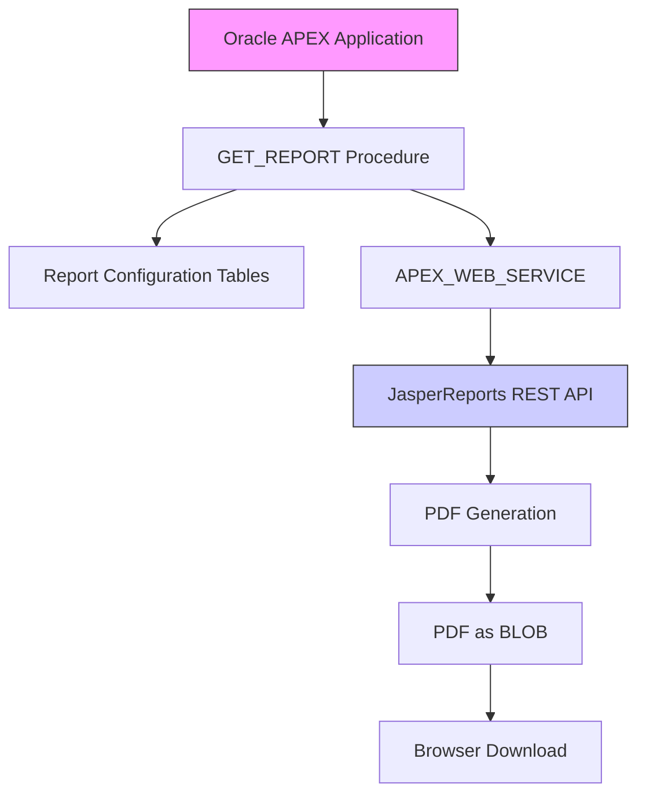

# Oracle APEX - JasperReports PDF Integration

## 📋 Project Overview

A production-ready integration solution that enables Oracle APEX applications to dynamically generate and download PDF reports from JasperReports Server via REST API. This implementation provides a secure, configurable bridge between Oracle Database environments (including Autonomous Database) and JasperReports Server.

## ✨ Key Features

| Feature | Description |
|---------|-------------|
| **Dynamic Integration** | REST-based communication with JasperReports Server |
| **Parameter Support** | Runtime parameter override with fallback to defaults |
| **Centralized Configuration** | Database-driven server and report settings |
| **Secure Authentication** | Basic Auth with encrypted credential storage |
| **Direct PDF Streaming** | BLOB-to-browser delivery without intermediate files |
| **APEX Compatibility** | Designed for Oracle APEX and ORDS environments |
| **Comprehensive Error Handling** | Detailed diagnostics and status reporting |
| **Scalable Architecture** | Suitable for enterprise deployments |

## 🏗 System Architecture



## 📊 Database Schema

### **Report Settings Table** (`MANG_SYS_SEC_REPORT_SETTINGS`)
Stores JasperReports server connection configurations.

```sql
CREATE TABLE MANG_SYS_SEC_REPORT_SETTINGS (
    settings_id        NUMBER PRIMARY KEY,
    jasper_server_url  VARCHAR2(500) NOT NULL,
    username           VARCHAR2(100) NOT NULL,
    password           VARCHAR2(100) NOT NULL,
    is_active          CHAR(1) DEFAULT 'Y',
    created_date       DATE DEFAULT SYSDATE,
    updated_date       DATE DEFAULT SYSDATE,
    CONSTRAINT chk_active CHECK (is_active IN ('Y', 'N'))
);

-- Optional: Add encryption for password column
-- Consider using Oracle Wallet or Transparent Data Encryption
```

### **Report Configuration Table** (`MANG_SYS_SEC_REPORT_CONFIG`)
Defines individual reports and their default parameters.

```sql
CREATE TABLE MANG_SYS_SEC_REPORT_CONFIG (
    report_id      NUMBER PRIMARY KEY,
    settings_id    NUMBER NOT NULL,
    report_path    VARCHAR2(500) NOT NULL,
    report_name    VARCHAR2(200) NOT NULL,
    default_params VARCHAR2(500),
    is_active      CHAR(1) DEFAULT 'Y',
    created_date   DATE DEFAULT SYSDATE,
    updated_date   DATE DEFAULT SYSDATE,
    FOREIGN KEY (settings_id) 
      REFERENCES MANG_SYS_SEC_REPORT_SETTINGS(settings_id),
    CONSTRAINT chk_active_config CHECK (is_active IN ('Y', 'N'))
);

-- Index for performance
CREATE INDEX idx_report_config_active 
  ON MANG_SYS_SEC_REPORT_CONFIG(is_active, report_id);
```

## ⚙️ Core Implementation

### **Main Procedure: `GET_REPORT`**

```sql
CREATE OR REPLACE PROCEDURE GET_REPORT (
    p_report_id     IN NUMBER,
    p_settings_id   IN NUMBER DEFAULT NULL,
    p_param_value   IN VARCHAR2 DEFAULT NULL
) 
AUTHID CURRENT_USER
AS
    -- Variable declarations
    l_report_config   MANG_SYS_SEC_REPORT_CONFIG%ROWTYPE;
    l_report_settings MANG_SYS_SEC_REPORT_SETTINGS%ROWTYPE;
    l_rest_url        VARCHAR2(2000);
    l_report_params   VARCHAR2(1000);
    l_username        VARCHAR2(100);
    l_password        VARCHAR2(100);
    l_response_clob   CLOB;
    l_pdf_blob        BLOB;
    l_http_status     NUMBER;
    l_param_list      APEX_T_VARCHAR2;
    l_query_string    VARCHAR2(1000) := '';
    l_use_settings_id NUMBER;
    i                 PLS_INTEGER;
BEGIN
    -- 1. Retrieve and validate report configuration
    BEGIN
        SELECT *
        INTO l_report_config
        FROM MANG_SYS_SEC_REPORT_CONFIG
        WHERE report_id = p_report_id
          AND is_active = 'Y';
    EXCEPTION
        WHEN NO_DATA_FOUND THEN
            RAISE_APPLICATION_ERROR(-20002, 
                'Report configuration not found or inactive for ID: ' || p_report_id);
    END;
    
    -- 2. Determine which server settings to use
    l_use_settings_id := NVL(p_settings_id, l_report_config.settings_id);
    
    BEGIN
        SELECT *
        INTO l_report_settings
        FROM MANG_SYS_SEC_REPORT_SETTINGS
        WHERE settings_id = l_use_settings_id
          AND is_active = 'Y';
    EXCEPTION
        WHEN NO_DATA_FOUND THEN
            RAISE_APPLICATION_ERROR(-20003, 
                'Server settings not found or inactive for ID: ' || l_use_settings_id);
    END;
    
    -- 3. Process report parameters
    l_report_params := NVL(p_param_value, l_report_config.default_params);
    
    IF l_report_params IS NOT NULL THEN
        l_param_list := APEX_STRING.SPLIT(l_report_params, ';');
        
        FOR i IN 1..l_param_list.COUNT LOOP
            IF i > 1 THEN
                l_query_string := l_query_string || '&';
            END IF;
            
            -- Handle both "key=value" and "value-only" formats
            IF INSTR(l_param_list(i), '=') > 0 THEN
                l_query_string := l_query_string || l_param_list(i);
            ELSE
                l_query_string := l_query_string || 'p' || i || '=' || 
                                 UTL_URL.ESCAPE(l_param_list(i), TRUE, 'UTF-8');
            END IF;
        END LOOP;
    END IF;
    
    -- 4. Construct REST API endpoint URL
    l_rest_url := RTRIM(l_report_settings.jasper_server_url, '/') || 
                  '/rest_v2/reports' || 
                  l_report_config.report_path || 
                  '.pdf';
                  
    IF l_query_string IS NOT NULL THEN
        l_rest_url := l_rest_url || '?' || l_query_string;
    END IF;
    
    -- 5. Prepare authentication
    l_username := l_report_settings.username;
    l_password := l_report_settings.password;
    
    -- 6. Configure HTTP request headers
    APEX_WEB_SERVICE.G_REQUEST_HEADERS.DELETE;
    APEX_WEB_SERVICE.SET_REQUEST_HEADER('Accept', 'application/pdf');
    
    -- 7. Execute REST call to JasperReports Server
    BEGIN
        l_response_clob := APEX_WEB_SERVICE.MAKE_REST_REQUEST(
            p_url               => l_rest_url,
            p_http_method       => 'GET',
            p_username          => l_username,
            p_password          => l_password,
            p_transfer_timeout  => 300,
            p_wallet_path       => 'file:/path/to/wallet'  -- Optional: for SSL
        );
        
        l_http_status := APEX_WEB_SERVICE.GET_LAST_HTTP_STATUS_CODE;
        
    EXCEPTION
        WHEN OTHERS THEN
            RAISE_APPLICATION_ERROR(-20004, 
                'HTTP request failed: ' || SQLERRM || 
                '. URL: ' || SUBSTR(l_rest_url, 1, 500));
    END;
    
    -- 8. Process successful response
    IF l_http_status = 200 AND l_response_clob IS NOT NULL THEN
        l_pdf_blob := APEX_WEB_SERVICE.GET_BLOB_RESPONSE;
        
        IF l_pdf_blob IS NOT NULL AND DBMS_LOB.GETLENGTH(l_pdf_blob) > 100 THEN
            -- 9. Stream PDF to browser
            OWA_UTIL.MIME_HEADER('application/pdf', FALSE);
            HTP.P('Content-Length: ' || DBMS_LOB.GETLENGTH(l_pdf_blob));
            HTP.P('Content-Disposition: attachment; filename="' || 
                  l_report_config.report_name || '_' || 
                  TO_CHAR(SYSDATE, 'YYYYMMDD_HH24MISS') || '.pdf"');
            OWA_UTIL.HTTP_HEADER_CLOSE;
            
            WPG_DOCLOAD.DOWNLOAD_FILE(l_pdf_blob);
            APEX_APPLICATION.STOP_APEX_ENGINE;
        ELSE
            RAISE_APPLICATION_ERROR(-20005, 
                'Invalid or empty PDF received from JasperReports server');
        END IF;
    ELSE
        -- 10. Handle HTTP errors
        RAISE_APPLICATION_ERROR(-20006, 
            'JasperReports server returned HTTP ' || l_http_status || 
            '. URL: ' || SUBSTR(l_rest_url, 1, 500));
    END IF;
    
EXCEPTION
    WHEN TOO_MANY_ROWS THEN
        RAISE_APPLICATION_ERROR(-20007, 
            'Multiple active configurations found. Verify data integrity.');
    WHEN OTHERS THEN
        -- Log error details for debugging
        INSERT INTO error_log (error_time, error_message, report_id)
        VALUES (SYSDATE, SQLERRM, p_report_id);
        COMMIT;
        
        RAISE_APPLICATION_ERROR(-20008, 
            'Report generation failed: ' || SQLERRM);
END GET_REPORT;
/
```

## 🚀 Usage Examples

### **Basic Usage**
```sql
-- Generate report with default parameters
BEGIN
    GET_REPORT(p_report_id => 1);
END;
/

-- Generate report with custom parameters
BEGIN
    GET_REPORT(
        p_report_id   => 1,
        p_param_value => 'department_id=1001;start_date=2025-01-01;end_date=2025-12-31'
    );
END;
/

-- Use alternative server configuration
BEGIN
    GET_REPORT(
        p_report_id   => 1,
        p_settings_id => 2,  -- Alternative server
        p_param_value => '1001;2025'
    );
END;
/
```

### **APEX Integration**
Create an Application Process or Page Process:

```sql
-- APEX Application Process (On Demand)
BEGIN
    GET_REPORT(
        p_report_id   => :P1_REPORT_ID,
        p_param_value => :P1_PARAMS
    );
END;
```

## 🔐 Security Best Practices

### **Credential Management**
1. **Encrypt Sensitive Data**: Use Oracle's DBMS_CRYPTO or TDE for password encryption
2. **Wallet Integration**: Store credentials in Oracle Wallet for enhanced security
3. **Regular Rotation**: Implement credential rotation policies

### **Access Control**
```sql
-- Grant minimal required privileges
GRANT EXECUTE ON GET_REPORT TO apex_app_user;

-- Create a secure view for configuration
CREATE OR REPLACE VIEW vw_report_config_secure AS
SELECT report_id, report_path, report_name, default_params
FROM MANG_SYS_SEC_REPORT_CONFIG
WHERE is_active = 'Y';
```

### **Input Validation**
- Sanitize all user inputs
- Implement parameter whitelisting
- Validate report IDs against user permissions

## 📈 Performance Optimization

### **Indexing Strategy**
```sql
-- Add performance indexes
CREATE INDEX idx_report_config_composite 
  ON MANG_SYS_SEC_REPORT_CONFIG(settings_id, is_active);

CREATE INDEX idx_report_settings_active 
  ON MANG_SYS_SEC_REPORT_SETTINGS(is_active, settings_id);
```

### **Caching Implementation**
```sql
-- Optional: Add caching table for frequent reports
CREATE TABLE report_cache (
    cache_key VARCHAR2(500) PRIMARY KEY,
    pdf_content BLOB,
    created_date DATE DEFAULT SYSDATE,
    expiry_date DATE
);
```

## 🔧 Troubleshooting Guide

| Issue | Solution |
|-------|----------|
| **HTTP 401 Unauthorized** | Verify credentials in settings table; check JasperReports server access |
| **HTTP 404 Not Found** | Validate report path and server URL configuration |
| **Empty PDF response** | Check report parameters and JasperReports server logs |
| **Timeout errors** | Increase `p_transfer_timeout`; verify network connectivity |
| **Encoding issues** | Ensure proper URL encoding for parameters with special characters |
| **ACL restrictions** | Configure network ACLs for database server |

### **Diagnostic Queries**
```sql
-- Check active configurations
SELECT c.report_id, c.report_name, s.jasper_server_url
FROM MANG_SYS_SEC_REPORT_CONFIG c
JOIN MANG_SYS_SEC_REPORT_SETTINGS s 
  ON c.settings_id = s.settings_id
WHERE c.is_active = 'Y' 
  AND s.is_active = 'Y';

-- Test URL construction
SELECT s.jasper_server_url || '/rest_v2/reports' || c.report_path || '.pdf' as test_url
FROM MANG_SYS_SEC_REPORT_CONFIG c, MANG_SYS_SEC_REPORT_SETTINGS s
WHERE c.settings_id = s.settings_id
  AND c.report_id = 1;
```

## 📋 Deployment Checklist

### **Pre-Deployment**
- [ ] Verify Oracle APEX version compatibility (20.1+)
- [ ] Confirm network connectivity between Oracle DB and JasperReports Server
- [ ] Configure necessary ACLs for external HTTP calls
- [ ] Set up Oracle Wallet if using SSL/TLS (recommended)

### **Database Setup**
1. Execute table creation scripts
2. Populate configuration tables with environment-specific settings
3. Deploy the `GET_REPORT` procedure
4. Grant execute privileges to APEX application schema
5. Create necessary indexes for performance

### **Post-Deployment**
1. Test with sample report ID
2. Validate PDF generation and download
3. Configure APEX application integration
4. Set up monitoring and alerting
5. Document configuration for operational support

## 🧪 Testing Strategy

### **Unit Tests**
```sql
-- Test procedure with various scenarios
DECLARE
    l_report_id NUMBER := 1;
BEGIN
    -- Test 1: Default parameters
    GET_REPORT(p_report_id => l_report_id);
    
    -- Test 2: Custom parameters
    GET_REPORT(
        p_report_id   => l_report_id,
        p_param_value => 'test_param=value'
    );
    
    -- Test 3: Invalid report (should raise error)
    BEGIN
        GET_REPORT(p_report_id => 9999);
        DBMS_OUTPUT.PUT_LINE('ERROR: Should have raised exception');
    EXCEPTION
        WHEN OTHERS THEN
            DBMS_OUTPUT.PUT_LINE('Expected error: ' || SQLERRM);
    END;
END;
/
```

## 📚 Additional Resources

### **Related Documentation**
- [Oracle APEX Web Service Guide](https://docs.oracle.com/database/apex-20.1/AEAPI/APEX_WEB_SERVICE.htm)
- [JasperReports REST API Reference](https://community.jaspersoft.com/documentation)
- [Oracle Database Security Guide](https://docs.oracle.com/en/database/)

### **Monitoring & Logging**
Consider implementing:
- Comprehensive error logging table
- Usage statistics collection
- Performance metrics monitoring
- Alerting for failed report generations

## 👤 Author & Support

**Malek Mohammed Al-Edresi**  
Oracle Certified Professional | APEX Developer Specialist  
Specializing in Oracle Database Architecture, APEX Development, and Enterprise Integration

📧 Contact: [LinkedIn Profile](https://linkedin.com/in/malek-al-edresi)  
🐙 GitHub: [malek-al-edresi](https://github.com/malek-al-edresi)

---

**License**: This solution is provided for enterprise use. Ensure compliance with your organization's security policies and licensing requirements for both Oracle and JasperReports software.

**Version**: 2.0  
**Last Updated**: December 2024  
**Compatibility**: Oracle Database 19c+, APEX 20.1+, JasperReports Server 7.5+